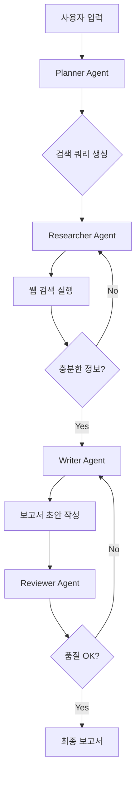

# 🔍 자율 리서치 & 리포트 생성 에이전트

LangGraph와 Multi-Agent 시스템을 활용한 자동 리서치 및 보고서 생성 프로젝트입니다.

## 🎯 학습 목표

이 프로젝트를 통해 다음을 학습할 수 있습니다:
- **LangGraph**: 에이전트 워크플로우 그래프 구성
- **Multi-Agent**: 여러 전문 에이전트 협업
- **Tool Calling**: 외부 API 호출 도구 사용
- **State Management**: 에이전트 상태 관리
- **Human-in-the-Loop**: 인간 개입 지점 설정

## 🏗️ 시스템 아키텍처

```
┌─────────────────────────────────────────────────────────┐
│                    Research Agent System                 │
├─────────────────────────────────────────────────────────┤
│                                                          │
│  ┌──────────┐    ┌──────────┐    ┌──────────┐           │
│  │ Planner  │───▶│Researcher│───▶│  Writer  │           │
│  │  Agent   │    │  Agent   │    │  Agent   │           │
│  └──────────┘    └──────────┘    └──────────┘           │
│       │              │               │                   │
│       ▼              ▼               ▼                   │
│  ┌──────────┐    ┌──────────┐    ┌──────────┐           │
│  │  Query   │    │Web Search│    │  Report  │           │
│  │Generator │    │   Tool   │    │Generator │           │
│  └──────────┘    └──────────┘    └──────────┘           │
│                                      │                   │
│                                      ▼                   │
│                              ┌──────────────┐           │
│                              │ Final Report │           │
│                              │  (Markdown)  │           │
│                              └──────────────┘           │
│                                                          │
└─────────────────────────────────────────────────────────┘
```

## 📁 프로젝트 구조

```
research-agent/
├── README.md               # 프로젝트 설명
├── requirements.txt        # 의존성 패키지
├── .env.example            # 환경변수 예시
├── app.py                  # 메인 CLI 애플리케이션
├── app_web.py              # 웹 UI (Streamlit)
├── agents/
│   ├── __init__.py
│   ├── planner.py          # 리서치 계획 에이전트
│   ├── researcher.py       # 웹 검색 에이전트
│   ├── writer.py           # 보고서 작성 에이전트
│   └── reviewer.py         # 검토 에이전트
├── tools/
│   ├── __init__.py
│   ├── web_search.py       # 웹 검색 도구
│   └── scraper.py          # 웹 스크래핑 도구
├── graph/
│   ├── __init__.py
│   ├── state.py            # 상태 정의
│   └── workflow.py         # LangGraph 워크플로우
└── reports/                # 생성된 보고서 저장
```

## 🚀 시작하기

### 1. 환경 설정

```bash
cd research-agent

# 가상환경 생성
python -m venv venv
venv\Scripts\activate  # Windows

# 의존성 설치
pip install -r requirements.txt
```

### 2. API 키 설정

`.env.example`을 `.env`로 복사:
```bash
copy .env.example .env
```

필요한 API 키:
- **OPENAI_API_KEY**: OpenAI API 키 (필수)
- **TAVILY_API_KEY**: Tavily 검색 API 키 (권장)
- **SERPER_API_KEY**: Serper 검색 API 키 (대안)

### 3. 실행

#### CLI 버전
```bash
python app.py "인공지능의 미래 전망"
```

#### 웹 UI 버전
```bash
streamlit run app_web.py
```

## 💡 사용 예시

```bash
# 특정 주제 리서치
python app.py "2025년 AI 기술 트렌드"

# 상세 옵션
python app.py "전기차 시장 분석" --depth deep --format markdown

# 특정 도메인 집중
python app.py "React vs Vue 비교" --domain tech
```

## 🔧 에이전트 설명

### 1. Planner Agent (계획 에이전트)
- 리서치 주제 분석
- 세부 검색 쿼리 생성
- 리서치 전략 수립

### 2. Researcher Agent (연구 에이전트)
- 웹 검색 실행
- 정보 수집 및 정리
- 출처 추적

### 3. Writer Agent (작성 에이전트)
- 수집된 정보 종합
- 구조화된 보고서 작성
- 인용 및 참조 추가

### 4. Reviewer Agent (검토 에이전트)
- 보고서 품질 검토
- 사실 확인 요청
- 개선 제안

## 📊 워크플로우 다이어그램



## 🛠️ 확장 아이디어

1. **멀티모달 지원**: 이미지, 차트 포함
2. **실시간 뉴스**: 뉴스 API 연동
3. **PDF 내보내기**: 보고서 PDF 변환
4. **스케줄링**: 정기 리서치 자동화
5. **DB 저장**: 리서치 결과 데이터베이스화

## 📚 참고 자료

- [LangGraph 공식 문서](https://langchain-ai.github.io/langgraph/)
- [Tavily API](https://tavily.com/)
- [LangChain Tools](https://python.langchain.com/docs/integrations/tools/)
